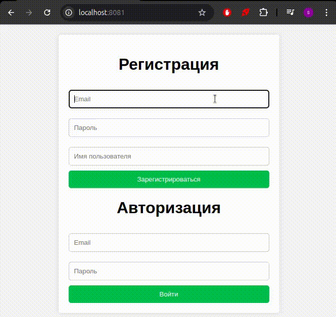

# TodoTracker

## Описание проекта

**TodoTracker** — это веб-приложение для управления задачами. Приложение предоставляет пользователям возможность легко создавать, редактировать и отслеживать свои задачи.

## Функциональные возможности

- **Авторизация и регистрация**: Реализован механизм авторизации и регистрации пользователей с помощью библиотеки fastapi-users.
- **Управление задачами**: Пользователи могут создавать новые задачи, редактировать их и отмечать как выполненные.
- **Статистика**: Приложение ведет учет общего количества задач, созданных пользователем, а также количества выполненных задач.

## Технологии

- **Python**, **FastAPI**, **SQLAlchemy**, **Alembic**, **Redis**, **Nginx**

## Установка и запуск

Для запуска проекта вам потребуется Docker и Docker Compose. Следуйте инструкциям ниже:

1. Клонируйте репозиторий и запустите docker compose:

   ```bash
   git clone https://github.com/IgoshinSergey/TodoTracker.git
   cd TodoTracker/src
   docker compose up --build
   ```

2. Откройте веб-интерфейс в браузере по адресу http://localhost:8081.

## Пример использования



